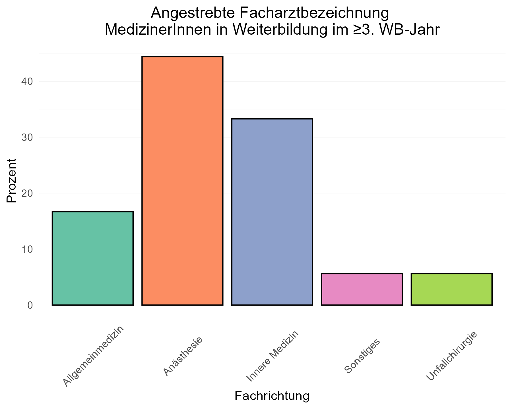
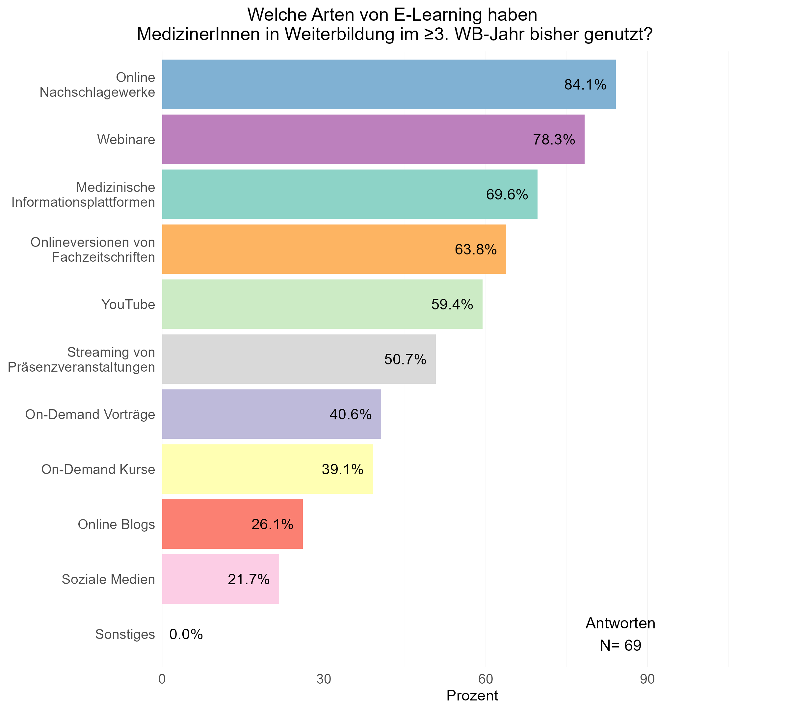
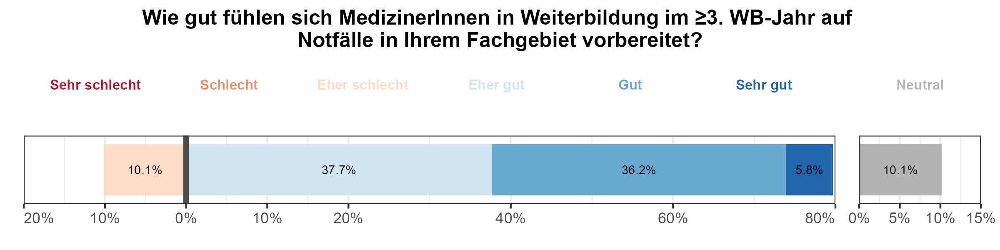
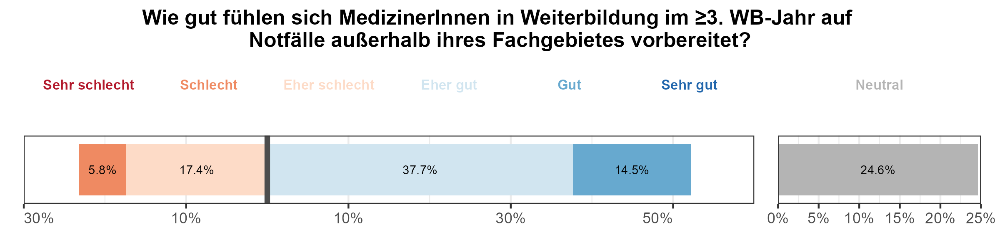
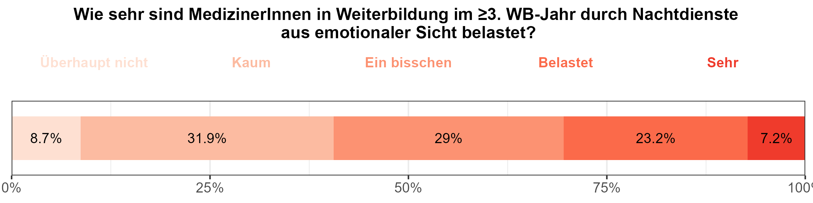
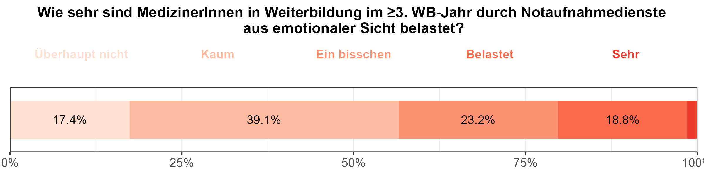

BEAM-Auswertung: (Alt-)assistentInnen in Weiterbildung - 3. WB-Jahr und
höher
================

------------------------------------------------------------------------

# 1 - Basisdaten

## Frage 1.1 - Welcher Altersgruppe gehören sie an?

|     Alter     | Anzahl | Prozent |
|:-------------:|:------:|:-------:|
|     25-30     |   16   |  23.2   |
|     31-35     |   36   |  52.2   |
|     36-40     |   13   |  18.8   |
|     41-45     |   3    |   4.3   |
|     46-50     |   1    |   1.4   |
| Antworten (N) |   69   |  100.0  |

## Frage 1.5 - In welchem Weiterbildungsjahr befinden Sie sich zum Zeitpunkt der Umfrage?

| Weiterbildungsjahr | Anzahl | Prozent |
|:------------------:|:------:|:-------:|
|         3          |   15   |  21.7   |
|         4          |   23   |  33.3   |
|         5          |   21   |  30.4   |
|         6          |   9    |  13.0   |
|         8          |   1    |   1.4   |
|   Antworten (N)    |   69   |  100.0  |

## Frage 1.6 - In welchem Fachgebiet streben Sie einen Facharzttitel an?

| Anzahl | Prozent |
|:------:|:-------:|
|   6    |  33.3   |
|   3    |  16.7   |
|   8    |  44.4   |
|   1    |   5.6   |
|   0    |   0.0   |
|   0    |   0.0   |
|   0    |   0.0   |
|   0    |   0.0   |
|   1    |   5.6   |
|   18   |  100.0  |

## Frage 1.8 - Planen Sie, die Zusatzbezeichnung “Klinische Akut- und Notfallmedizin” zu erwerben?

| Wollen Zusatzbezeichnung | Anzahl | Prozent |
|:------------------------:|:------:|:-------:|
|            Ja            |   43   |  62.3   |
|           Nein           |   26   |  37.7   |
|      Antworten (N)       |   69   |  100.0  |

## Frage 1.10 - In welchem Arbeitsumfeld sind Sie klinisch tätig?

|                 Arbeitsumfeld                  | Anzahl | Prozent |
|:----------------------------------------------:|:------:|:-------:|
|       Kleines Krankenhaus (\<200 Betten)       |   6    |   8.7   |
|   Mittelgroßes Krankenhaus (200-500 Betten)    |   32   |  46.4   |
| Schwerpunkt- / Maximalversorger (\>500 Betten) |   31   |  44.9   |
|                    Ambulant                    |   0    |   0.0   |
|           Ausschließlich Präklinisch           |   0    |   0.0   |
|                   Sonstiges                    |   0    |   0.0   |
|                 Antworten (N)                  |   69   |  100.0  |

## Frage 1.11 - Sind Sie hauptsächlich in der Notaufnahme tätig?

| Hauptsächlich Notaufnahme | Anzahl | Prozent |
|:-------------------------:|:------:|:-------:|
|            Ja             |   23   |  33.3   |
|           Nein            |   46   |  66.7   |
|       Antworten (N)       |   69   |  100.0  |

## Frage 1.12 - Ist Deutsch Ihre Muttersprache?

| Muttersprache | Anzahl | Prozent |
|:-------------:|:------:|:-------:|
|    Deutsch    |   60   |  88.2   |
|    Andere     |   8    |  11.8   |
| Antworten (N) |   68   |  100.0  |

------------------------------------------------------------------------

# 2 - Motive zur Fort- & Weiterbildung

## Frage 2.15 - Aus welchen Gründen nehmen Sie regelmäßig an Fort- und Weiterbildungen teil?

| Antwortoption | Anzahl | Prozent |
|:--:|:--:|:--:|
| Ich möchte die Qualität meiner Arbeit verbessern | 64 | 92.8 |
| Ich habe persönliches / berufliches Interesse an den Inhalten | 57 | 82.6 |
| Ich möchte die Versorgungsqualität meiner PatientInnen verbessern | 56 | 81.2 |
| Weil ich fachlich auf dem neuesten Stand bleiben möchte | 55 | 79.7 |
| Ich habe Angst Fehler zu machen | 12 | 17.4 |
| Ich sammle CME Punkte | 4 | 5.8 |
| Mein Arbeitgeber erwartet oder fordert es von mir | 3 | 4.3 |
| Ich möchte Zertifikate / Urkunden erlangen welche ich präsentieren / ausstellen kann | 3 | 4.3 |
| Ich brauche Fortbildungen als Voraussetzung für Zertifizierungen (der Praxis/Abteilung oä.) | 3 | 4.3 |
| Weil mein Umfeld sich regelmäßig fortbildet | 2 | 2.9 |
| Mein Fortbildungsbudget soll nicht verfallen | 1 | 1.4 |
| Ich brauche Fortbildungen als Voraussetzung zur Abrechnung bestimmter Leistungen | 0 | 0.0 |
| Antworten (N) | 69 | 100.0 |

------------------------------------------------------------------------

# 3 - Bisherige Nutzung von E-Learning

## Frage 3.16 - Haben Sie in der Vergangenheit bereits E-Learning Angebote zur medizinischen Fort- & Weiterbildung genutzt?

| Bereits E-Learning genutzt | Anzahl | Prozent |
|:--------------------------:|:------:|:-------:|
|             Ja             |   65   |  94.2   |
|            Nein            |   4    |   5.8   |
|       Antworten (N)        |   69   |  100.0  |

## Frage 3.17 - Welche Art von E-Learning Angeboten haben Sie bereits zur medizinischen Fort- & Weiterbildung genutzt?

| Antwortoption | Anzahl | Prozent |
|:--:|:--:|:--:|
| Online-Nachschlagewerke (Amboss, UpToDate, DocCheck etc.) | 58 | 84.1 |
| Webinare (Live-Veranstaltungen, nur online stattfindend) | 54 | 78.3 |
| Medizinische Informationsplattformen (Ärzteblatt, Medscape, DocCheck etc.) | 48 | 69.6 |
| Online-Versionen von Fachzeitschriften | 44 | 63.8 |
| YouTube | 41 | 59.4 |
| Streaming von Präsenzveranstaltungen (Virtuelle Kongressteilnahme o.Ä.) | 35 | 50.7 |
| On-Demand - einzelne Vorträge | 28 | 40.6 |
| On-Demand - ganze Kurse (EKG Kurs, Facharztvorbereitungskurs, Amboss CME-Kurse etc.) | 27 | 39.1 |
| Online Blogs | 18 | 26.1 |
| Soziale Medien (X/Twitter, Instagram, TikTok etc.) | 15 | 21.7 |
| Sonstige | 0 | 0.0 |
| Antworten (N) | 69 | 100.0 |

## Frage 3.18 - Mit welchen Endgeräten haben Sie E-Learning Inhalte bisher genutzt?

|    Antwortoption    | Anzahl | Prozent |
|:-------------------:|:------:|:-------:|
| Laptop / Desktop-PC |   56   |  81.2   |
|     Smartphone      |   47   |  68.1   |
|       Tablet        |   24   |  34.8   |
|    Antworten (N)    |   69   |  100.0  |

------------------------------------------------------------------------

# 4 - Bisherige Finanzierung von E-Learning

## Frage 4.19 - Haben Sie bereits kostenpflichtige E-Learning Inhalte genutzt? (z.B. Amboss, UpToDate, Onlinekurse o.Ä.)

| Bereits kostenpflichtiges E-Learning genutzt | Anzahl | Prozent |
|:--------------------------------------------:|:------:|:-------:|
|                      Ja                      |   64   |  92.8   |
|                     Nein                     |   5    |   7.2   |
|                Antworten (N)                 |   69   |  100.0  |

\## Frage 4.20 - Welche Art von kostenpflichtigen E-Learning Angeboten
haben Sie bereits zur medizinischen Fort & Weiterbildung genutzt?

| Antwortoption | Anzahl | Prozent |
|:--:|:--:|:--:|
| Nachschlagewerke wie UpToDate oder Amboss | 53 | 76.8 |
| Live-Streaming von Präsenzveranstaltungen (Kongresse, Kurse, Vorträge o. Ä.) | 35 | 50.7 |
| Ganze Kursformate On-Demand (z.B. EKG-Kurs, Facharztvorbereitungskurs o. Ä.) | 24 | 34.8 |
| Kostenpflichtige Podcasts (z.B. Pincast o. Ä.) | 14 | 20.3 |
| Plattformen zum Abruf von On-Demand-Vorträgen | 13 | 18.8 |
| Sonstiges | 1 | 1.4 |
| Antworten (N) | 69 | 100.0 |

## Frage 4.21 - Durch wen wurden die von Ihnen genutzten E-Learning Angebote finanziert?

|                       Antwortoption                        | Anzahl | Prozent |
|:----------------------------------------------------------:|:------:|:-------:|
|               Vollständig durch mich selbst                |   31   |  44.9   |
|   Teils durch den Arbeitgeber / Teils durch mich selbst    |   26   |  37.7   |
|             Vollständig durch den Arbeitgeber              |   16   |  23.2   |
| Durch Unternehmen (z.B. Pharma, Medizinproduktehersteller) |   3    |   4.3   |
|                         Sonstiges                          |   0    |   0.0   |
|                       Antworten (N)                        |   69   |  100.0  |

------------------------------------------------------------------------

# 5 - Ideales E-Learning

## Frage 5.22 - Können Sie sich vorstellen, in Zukunft E-Learning Inhalte zur Fort- & Weiterbildung zu nutzen?

| Zukünftige Nutzung E-Learning | Anzahl | Prozent |
|:-----------------------------:|:------:|:-------:|
|              Ja               |   69   |   100   |
|             Nein              |   0    |    0    |
|         Antworten (N)         |   69   |   100   |

## Frage 5.23 - Würden Sie E-Learning für folgende Anwendungsfälle nutzen?

| Abfrage | Antworten N (%) | Auf keinen Fall | Wahrscheinlich nicht | Eher nicht | Neutral | Eher ja | Wahrscheinlich ja | Auf jeden Fall |
|:--:|:--:|:--:|:--:|:--:|:--:|:--:|:--:|:--:|
| Erlernen fachlicher |  |  |  |  |  |  |  |  |
| Grundlagen | 69 (100%) | 0 (0%) | 3 (4.3%) | 3 (4.3%) | 5 (7.2%) | 9 (13%) | 23 (33.3%) | 26 (37.7%) |
| Alternative zu Präsenzveranstaltungen | 69 (100%) | 0 (0%) | 3 (4.3%) | 6 (8.7%) | 10 (14.5%) | 12 (17.4%) | 20 (29%) | 18 (26.1%) |
| Weiterbildung in spez. Fachbereichen | 69 (100%) | 1 (1.4%) | 0 (0%) | 1 (1.4%) | 4 (5.8%) | 9 (13%) | 32 (46.4%) | 22 (31.9%) |
| Wissen aktuell halten | 69 (100%) | 0 (0%) | 0 (0%) | 0 (0%) | 2 (2.9%) | 6 (8.7%) | 23 (33.3%) | 38 (55.1%) |
| CME-Punkte sammeln | 69 (100%) | 0 (0%) | 2 (2.9%) | 2 (2.9%) | 6 (8.7%) | 7 (10.1%) | 21 (30.4%) | 31 (44.9%) |

## Frage 5.24 - Wie wichtig ist es Ihnen, CME-Punkte für die E-Learning Inhalte zu erhalten?

| Abfrage | Antworten N (%) | Unwichtig | Eher unwichtig | Weniger wichtig | Neutral | Eher wichtig | Wichtig | Sehr wichtig |
|:--:|:--:|:--:|:--:|:--:|:--:|:--:|:--:|:--:|
| CME-Punkte erhalten | 63 (100%) | 0 (0%) | 5 (7.9%) | 7 (11.1%) | 19 (30.2%) | 21 (33.3%) | 9 (14.3%) | 2 (3.2%) |

------------------------------------------------------------------------

# 6 - Vorbereitung auf notfallmedizinische Krankheitsbilder

## Frage 6.33 - Wie gut fühlen Sie sich auf die Behandlung akut- & notfallmedizinischer Krankheitsbilder in ihrem Fachgebiet vorbereitet?

| Abfrage | Antworten N (%) | Sehr schlecht | Schlecht | Eher schlecht | Neutral | Eher gut | Gut | Sehr gut |
|:--:|:--:|:--:|:--:|:--:|:--:|:--:|:--:|:--:|
| Notfallvorbereitung eigenes Fachgebiet | 69 (100%) | 0 (0%) | 0 (0%) | 7 (10.1%) | 7 (10.1%) | 26 (37.7%) | 25 (36.2%) | 4 (5.8%) |

## Frage 6.35 - Wie gut fühlen Sie sich auf die Behandlung akut- & notfallmedizinischer Krankheitsbilder anderer Fachbereiche vorbereitet?

| Abfrage | Antworten N (%) | Sehr schlecht | Schlecht | Eher schlecht | Neutral | Eher gut | Gut | Sehr gut |
|:--:|:--:|:--:|:--:|:--:|:--:|:--:|:--:|:--:|
| Notfallvorbereitung andere Fachgebiete | 69 (100%) | 0 (0%) | 4 (5.8%) | 12 (17.4%) | 17 (24.6%) | 26 (37.7%) | 10 (14.5%) | 0 (0%) |

## Frage 6.39 - Wie sehr belasten Sie **Nachtdienste** in Ihrem aktuellen Ausbildungsstand aus **emotionaler** Sicht?

| Abfrage | Überhaupt nicht | Kaum | Ein bisschen | Belastet | Sehr |
|:--:|:--:|:--:|:--:|:--:|:--:|
| Emotionale Belastung Nachtdienst | 6 | 22 | 20 | 16 | 5 |

## Frage 6.40 - Wie sehr belasten Sie Nachtdienste in Ihrem aktuellen Ausbildungsstand aus fachlicher Sicht?

| Abfrage | Überhaupt nicht | Kaum | Ein bisschen | Belastet | Sehr |
|:--:|:--:|:--:|:--:|:--:|:--:|
| Fachliche Belastung Nachtdienst | 4 | 23 | 28 | 12 | 2 |

## Frage 6.41 - Wie sehr belasten Sie Notaufnahmedienste in Ihrem aktuellen Ausbildungsstand aus emotionaler Sicht?

| Abfrage | Überhaupt nicht | Kaum | Ein bisschen | Belastet | Sehr |
|:--:|:--:|:--:|:--:|:--:|:--:|
| Emotionale Belastung Notaufnahmedienst | 12 | 27 | 16 | 13 | 1 |

## Frage 6.42 - Wie sehr belasten Sie Notaufnahmedienste in Ihrem aktuellen Ausbildungsstand aus fachlicher Sicht?

| Abfrage | Überhaupt nicht | Kaum | Ein bisschen | Belastet | Sehr |
|:--:|:--:|:--:|:--:|:--:|:--:|
| Fachliche Belastung Notaufnahmedienst | 11 | 26 | 21 | 9 | 2 |

------------------------------------------------------------------------

# 7 - Fortbildungsbudget und Zahlungsbereitschaft

## Frage 7.43 - Wie hoch ist das Fortbildungsbudget, welches Ihnen ihr Arbeitgeber pro Jahr zur Verfügung stellt?

| Fortbildungsbudget | Anzahl | Prozent |
|:------------------:|:------:|:-------:|
|     Anzahl (N)     |   49   |  100.0  |
|      \>1000€       |   7    |  14.3   |
|    801 - 1000€     |   3    |   6.1   |
|     601 - 800€     |   2    |   4.1   |
|     401 - 600€     |   11   |  22.4   |
|     200 - 400€     |   11   |  22.4   |
|      \< 200€       |   4    |   8.2   |
|    Kein Budget     |   11   |  22.4   |

## Frage 7.44 - Wie viele als Arbeitszeit gewertete Fortbildungstage gewährt Ihnen ihr Arbeitgeber pro Jahr?

| Fortbildungstage | Anzahl | Prozent |
|:----------------:|:------:|:-------:|
|    Anzahl (N)    |   53   |  100.0  |
|     \>5 Tage     |   4    |   7.5   |
|      5 Tage      |   24   |  45.3   |
|      4 Tage      |   5    |   9.4   |
|      3 Tage      |   12   |  22.6   |
|      2 Tage      |   4    |   7.5   |
|      1 Tag       |   1    |   1.9   |
|      Keine       |   3    |   5.7   |

## Frage 7.49 - Wie viel würden Sie persönlich, zusätzlich zum Fortbildungsbudget Ihres Arbeitgebers, für einen qualitativ hochwertigen Fortbildungskurs ausgeben?

| Zusätzliche Ausgabe | Anzahl | Prozent |
|:-------------------:|:------:|:-------:|
|     Anzahl (N)      |   69   |  100.0  |
|       \> 750€       |   30   |  43.5   |
|     601 - 750€      |   2    |   2.9   |
|     451 - 600€      |   16   |  23.2   |
|     301 - 450€      |   4    |   5.8   |
|     150 - 300€      |   12   |  17.4   |
|       \< 150€       |   2    |   2.9   |
|       Keines        |   3    |   4.3   |

## Frage 7.50 - Wie viel Geld würden Sie persönlich, zusätzlich zum Fortbildungsbudget Ihres Arbeitgebers, für einen qualitativ hochwertigen Fortbildungskurs in interdisziplinärer klinischer Notfallmedizin ausgeben?

| Zusätzliche Ausgabe | Anzahl | Prozent |
|:-------------------:|:------:|:-------:|
|     Anzahl (N)      |   69   |  100.0  |
|       \> 750€       |   27   |  39.1   |
|     601 - 750€      |   5    |   7.2   |
|     451 - 600€      |   13   |  18.8   |
|     301 - 450€      |   7    |  10.1   |
|     150 - 300€      |   9    |  13.0   |
|       \< 150€       |   2    |   2.9   |
|       Keines        |   6    |   8.7   |

