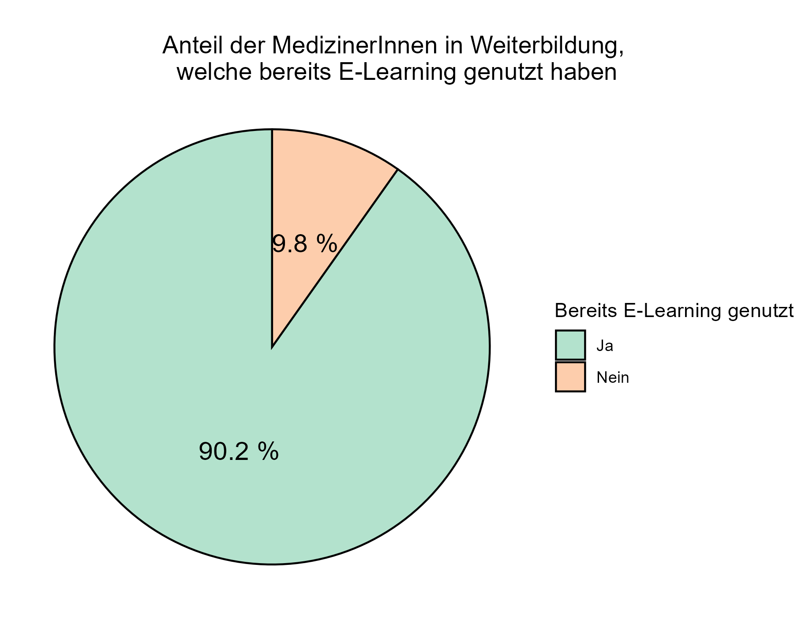
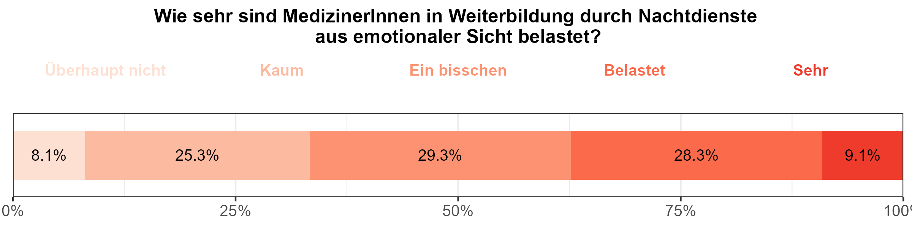
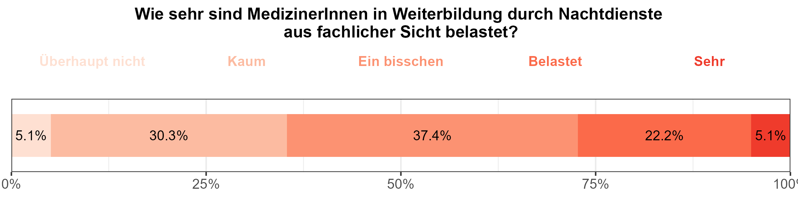
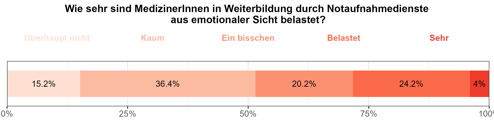

BEAM-Auswertung: MedizinerInnen in Weiterbildung
================

------------------------------------------------------------------------

# 1 - Basisdaten

## Frage 1.1 - Welcher Altersgruppe gehören sie an?

|     Alter     | Anzahl | Prozent |
|:-------------:|:------:|:-------:|
|     25-30     |   33   |  32.4   |
|     31-35     |   48   |  47.1   |
|     36-40     |   15   |  14.7   |
|     41-45     |   3    |   2.9   |
|     46-50     |   2    |   2.0   |
|     \>50      |   1    |   1.0   |
| Antworten (N) |  102   |  100.0  |

## Frage 1.5 - In welchem Weiterbildungsjahr befinden Sie sich zum Zeitpunkt der Umfrage?

| Weiterbildungsjahr | Anzahl | Prozent |
|:------------------:|:------:|:-------:|
|         1          |   16   |  16.2   |
|         2          |   14   |  14.1   |
|         3          |   15   |  15.2   |
|         4          |   23   |  23.2   |
|         5          |   21   |  21.2   |
|         6          |   9    |   9.1   |
|         8          |   1    |   1.0   |
|   Antworten (N)    |   99   |  100.0  |

## Frage 1.6 - In welchem Fachgebiet streben Sie einen Facharzttitel an?

|       Fachrichtung       | Anzahl | Prozent |
|:------------------------:|:------:|:-------:|
|      Innere Medizin      |   13   |  40.6   |
|     Allgemeinmedizin     |   7    |  21.9   |
|        Anästhesie        |   11   |  34.4   |
|     Unfallchirurgie      |   1    |   3.1   |
|    Viszeralchirurgie     |   0    |   0.0   |
| Anderes chir. Fachgebiet |   0    |   0.0   |
|        Neurologie        |   0    |   0.0   |
|         Urologie         |   0    |   0.0   |
|        Sonstiges         |   2    |   6.2   |
|                          |   32   |  100.0  |

## Frage 1.8 - Planen Sie, die Zusatzbezeichnung “Klinische Akut- und Notfallmedizin” zu erwerben?

| Wollen Zusatzbezeichnung | Anzahl | Prozent |
|:------------------------:|:------:|:-------:|
|            Ja            |   66   |  64.7   |
|           Nein           |   36   |  35.3   |
|      Antworten (N)       |  102   |  100.0  |

## Frage 1.10 - In welchem Arbeitsumfeld sind Sie klinisch tätig?

|                 Arbeitsumfeld                  | Anzahl | Prozent |
|:----------------------------------------------:|:------:|:-------:|
|       Kleines Krankenhaus (\<200 Betten)       |   8    |   7.8   |
|   Mittelgroßes Krankenhaus (200-500 Betten)    |   44   |  43.1   |
| Schwerpunkt- / Maximalversorger (\>500 Betten) |   45   |  44.1   |
|                    Ambulant                    |   3    |   2.9   |
|           Ausschließlich Präklinisch           |   0    |   0.0   |
|                   Sonstiges                    |   0    |   0.0   |
|                 Antworten (N)                  |  102   |  100.0  |

## Frage 1.11 - Sind Sie hauptsächlich in der Notaufnahme tätig?

| Hauptsächlich Notaufnahme | Anzahl | Prozent |
|:-------------------------:|:------:|:-------:|
|            Ja             |   28   |  28.9   |
|           Nein            |   69   |  71.1   |
|       Antworten (N)       |   97   |  100.0  |

## Frage 1.12 - Ist Deutsch Ihre Muttersprache?

| Muttersprache | Anzahl | Prozent |
|:-------------:|:------:|:-------:|
|    Deutsch    |   90   |  89.1   |
|    Andere     |   11   |  10.9   |
| Antworten (N) |  101   |  100.0  |

------------------------------------------------------------------------

# 2 - Motive zur Fort- & Weiterbildung

## Frage 2.15 - Aus welchen Gründen nehmen Sie regelmäßig an Fort- und Weiterbildungen teil?

| Antwortoption | Anzahl | Prozent |
|:--:|:--:|:--:|
| Ich möchte die Qualität meiner Arbeit verbessern | 94 | 92.2 |
| Ich habe persönliches / berufliches Interesse an den Inhalten | 86 | 84.3 |
| Ich möchte die Versorgungsqualität meiner PatientInnen verbessern | 82 | 80.4 |
| Weil ich fachlich auf dem neuesten Stand bleiben möchte | 77 | 75.5 |
| Ich habe Angst Fehler zu machen | 20 | 19.6 |
| Ich sammle CME Punkte | 8 | 7.8 |
| Mein Arbeitgeber erwartet oder fordert es von mir | 8 | 7.8 |
| Ich möchte Zertifikate / Urkunden erlangen welche ich präsentieren / ausstellen kann | 5 | 4.9 |
| Ich brauche Fortbildungen als Voraussetzung für Zertifizierungen (der Praxis/Abteilung oä.) | 5 | 4.9 |
| Weil mein Umfeld sich regelmäßig fortbildet | 4 | 3.9 |
| Mein Fortbildungsbudget soll nicht verfallen | 1 | 1.0 |
| Ich brauche Fortbildungen als Voraussetzung zur Abrechnung bestimmter Leistungen | 0 | 0.0 |
| Antworten (N) | 102 | 100.0 |

------------------------------------------------------------------------

# 3 - Bisherige Nutzung von E-Learning

## Frage 3.16 - Haben Sie in der Vergangenheit bereits E-Learning Angebote zur medizinischen Fort- & Weiterbildung genutzt?

| Bereits E-Learning genutzt | Anzahl | Prozent |
|:--------------------------:|:------:|:-------:|
|             Ja             |   92   |  90.2   |
|            Nein            |   10   |   9.8   |
|       Antworten (N)        |  102   |  100.0  |

## Frage 3.17 - Welche Art von E-Learning Angeboten haben Sie bereits zur medizinischen Fort- & Weiterbildung genutzt?

| Antwortoption | Anzahl | Prozent |
|:--:|:--:|:--:|
| Online-Nachschlagewerke (Amboss, UpToDate, DocCheck etc.) | 82 | 80.4 |
| Webinare (Live-Veranstaltungen, nur online stattfindend) | 75 | 73.5 |
| Medizinische Informationsplattformen (Ärzteblatt, Medscape, DocCheck etc.) | 71 | 69.6 |
| YouTube | 59 | 57.8 |
| Online-Versionen von Fachzeitschriften | 58 | 56.9 |
| Streaming von Präsenzveranstaltungen (Virtuelle Kongressteilnahme o.Ä.) | 48 | 47.1 |
| On-Demand - ganze Kurse (EKG Kurs, Facharztvorbereitungskurs, Amboss CME-Kurse etc.) | 38 | 37.3 |
| On-Demand - einzelne Vorträge | 36 | 35.3 |
| Online Blogs | 27 | 26.5 |
| Soziale Medien (X/Twitter, Instagram, TikTok etc.) | 24 | 23.5 |
| Sonstige | 0 | 0.0 |
| Antworten (N) | 102 | 100.0 |

## Frage 3.18 - Mit welchen Endgeräten haben Sie E-Learning Inhalte bisher genutzt?

|    Antwortoption    | Anzahl | Prozent |
|:-------------------:|:------:|:-------:|
| Laptop / Desktop-PC |   82   |  80.4   |
|     Smartphone      |   64   |  62.7   |
|       Tablet        |   36   |  35.3   |
|    Antworten (N)    |  102   |  100.0  |

------------------------------------------------------------------------

# 4 - Bisherige Finanzierung von E-Learning

## Frage 4.19 - Haben Sie bereits kostenpflichtige E-Learning Inhalte genutzt? (z.B. Amboss, UpToDate, Onlinekurse o.Ä.)

| Bereits kostenpflichtiges E-Learning genutzt | Anzahl | Prozent |
|:--------------------------------------------:|:------:|:-------:|
|                      Ja                      |   91   |  89.2   |
|                     Nein                     |   11   |  10.8   |
|                Antworten (N)                 |  102   |  100.0  |

\## Frage 4.20 - Welche Art von kostenpflichtigen E-Learning Angeboten
haben Sie bereits zur medizinischen Fort & Weiterbildung genutzt?

| Antwortoption | Anzahl | Prozent |
|:--:|:--:|:--:|
| Nachschlagewerke wie UpToDate oder Amboss | 79 | 77.5 |
| Live-Streaming von Präsenzveranstaltungen (Kongresse, Kurse, Vorträge o. Ä.) | 46 | 45.1 |
| Ganze Kursformate On-Demand (z.B. EKG-Kurs, Facharztvorbereitungskurs o. Ä.) | 36 | 35.3 |
| Plattformen zum Abruf von On-Demand-Vorträgen | 18 | 17.6 |
| Kostenpflichtige Podcasts (z.B. Pincast o. Ä.) | 16 | 15.7 |
| Sonstiges | 1 | 1.0 |
| Antworten (N) | 102 | 100.0 |

## Frage 4.21 - Durch wen wurden die von Ihnen genutzten E-Learning Angebote finanziert?

|                       Antwortoption                        | Anzahl | Prozent |
|:----------------------------------------------------------:|:------:|:-------:|
|               Vollständig durch mich selbst                |   43   |  42.2   |
|   Teils durch den Arbeitgeber / Teils durch mich selbst    |   37   |  36.3   |
|             Vollständig durch den Arbeitgeber              |   21   |  20.6   |
| Durch Unternehmen (z.B. Pharma, Medizinproduktehersteller) |   4    |   3.9   |
|                         Sonstiges                          |   0    |   0.0   |
|                       Antworten (N)                        |  102   |  100.0  |

------------------------------------------------------------------------

# 5 - Ideales E-Learning

## Frage 5.22 - Können Sie sich vorstellen, in Zukunft E-Learning Inhalte zur Fort- & Weiterbildung zu nutzen?

| Zukünftige Nutzung E-Learning | Anzahl | Prozent |
|:-----------------------------:|:------:|:-------:|
|              Ja               |  101   |   99    |
|             Nein              |   1    |    1    |
|         Antworten (N)         |  102   |   100   |

## Frage 5.23 - Würden Sie E-Learning für folgende Anwendungsfälle nutzen?

| Abfrage | Antworten N (%) | Auf keinen Fall | Wahrscheinlich nicht | Eher nicht | Neutral | Eher ja | Wahrscheinlich ja | Auf jeden Fall |
|:--:|:--:|:--:|:--:|:--:|:--:|:--:|:--:|:--:|
| Erlernen fachlicher |  |  |  |  |  |  |  |  |
| Grundlagen | 101 (100%) | 0 (0%) | 3 (3%) | 4 (4%) | 5 (5%) | 12 (11.9%) | 28 (27.7%) | 49 (48.5%) |
| Alternative zu Präsenzveranstaltungen | 101 (100%) | 0 (0%) | 5 (5%) | 12 (11.9%) | 14 (13.9%) | 19 (18.8%) | 24 (23.8%) | 27 (26.7%) |
| Weiterbildung in spez. Fachbereichen | 101 (100%) | 1 (1%) | 0 (0%) | 1 (1%) | 7 (6.9%) | 12 (11.9%) | 42 (41.6%) | 38 (37.6%) |
| Wissen aktuell halten | 101 (100%) | 0 (0%) | 0 (0%) | 0 (0%) | 3 (3%) | 7 (6.9%) | 29 (28.7%) | 62 (61.4%) |
| CME-Punkte sammeln | 101 (100%) | 1 (1%) | 3 (3%) | 2 (2%) | 8 (7.9%) | 11 (10.9%) | 23 (22.8%) | 53 (52.5%) |

## Frage 5.24 - Wie wichtig ist es Ihnen, CME-Punkte für die E-Learning Inhalte zu erhalten?

| Abfrage | Antworten N (%) | Unwichtig | Eher unwichtig | Weniger wichtig | Neutral | Eher wichtig | Wichtig | Sehr wichtig |
|:--:|:--:|:--:|:--:|:--:|:--:|:--:|:--:|:--:|
| CME-Punkte erhalten | 92 (100%) | 0 (0%) | 7 (7.6%) | 9 (9.8%) | 29 (31.5%) | 28 (30.4%) | 15 (16.3%) | 4 (4.3%) |

## Frage 5.25 - Welche Arten der Inhaltsvermittlung würden Sie in E-Learning Formaten gerne sehen?

| Antwortoption | Anzahl | Prozent |
|:--:|:--:|:--:|
| Kurze Textinhalte (\<10 Minuten), welche sich im Alltag zwischendurch lesen lassen | 58 | 56.9 |
| Video-Inhalte On-Demand | 57 | 55.9 |
| Audio-Inhalte On-Demand (Podcast, Audiomitschnitte von Vorträgen oä.) | 53 | 52.0 |
| Livestreams von Veranstaltungen / Vorträgen / Seminaren | 40 | 39.2 |
| Online-Vorträge (live) mit der Möglichkeit Fragen zu stellen | 39 | 38.2 |
| Online-Seminare in kleineren Gruppen | 22 | 21.6 |
| Lange Textinhalte (\> 10 Minuten), in welchen Themen ausführlicher erläutert werden | 18 | 17.6 |
| Antworten (N) | 102 | 100.0 |

## Frage 5.26 - Welche Kriterien wären/sind Ihnen wichtig für die Auswahl von Kursen & Inhalten?

| Antwortoption | Anzahl | Prozent |
|:--:|:--:|:--:|
| Alltagsrelevanz des Themas | 94 | 92.2 |
| Qualitätseindruck des Kurses und der Inhalte | 93 | 91.2 |
| Beteiligung von Fachgesellschaften am Kurs | 41 | 40.2 |
| Erhalt eines Zertifikates / einer Qualifikation mit Abschluss des Kurses | 27 | 26.5 |
| Bekannte Namen / Firmen hinter dem Kurs | 4 | 3.9 |
| Antworten (N) | 102 | 100.0 |

## Frage 5.31 - Auf welchen Wegen haben Sie bisher ihre Veranstaltungen zu Fort- & Weiterbildung hauptsächlich gefunden?

|                      Antwortoption                      | Anzahl | Prozent |
|:-------------------------------------------------------:|:------:|:-------:|
|              Empfehlungen von KollegInnen               |   75   |  73.5   |
|           Internetsuchmaschinen (Google o.Ä.)           |   61   |  59.8   |
|             Mailings von Fachgesellschaften             |   33   |  32.4   |
| Anzeigen in Printmedien (Zeitschriften / Journals o.Ä.) |   29   |  28.4   |
|                    Werbung per Email                    |   22   |  21.6   |
|        Fortbildungsdatenbanken der Ärztekammern         |   21   |  20.6   |
|                      Antworten (N)                      |  102   |  100.0  |

------------------------------------------------------------------------

# 6 - Vorbereitung auf notfallmedizinische Krankheitsbilder

## Frage 6.33 - Wie gut fühlen Sie sich auf die Behandlung akut- & notfallmedizinischer Krankheitsbilder in ihrem Fachgebiet vorbereitet?

| Abfrage | Antworten N (%) | Sehr schlecht | Schlecht | Eher schlecht | Neutral | Eher gut | Gut | Sehr gut |
|:--:|:--:|:--:|:--:|:--:|:--:|:--:|:--:|:--:|
| Notfallvorbereitung eigenes Fachgebiet | 100 (100%) | 0 (0%) | 2 (2%) | 14 (14%) | 12 (12%) | 38 (38%) | 30 (30%) | 4 (4%) |

## Frage 6.35 - Wie gut fühlen Sie sich auf die Behandlung akut- & notfallmedizinischer Krankheitsbilder anderer Fachbereiche vorbereitet?

| Abfrage | Antworten N (%) | Sehr schlecht | Schlecht | Eher schlecht | Neutral | Eher gut | Gut | Sehr gut |
|:--:|:--:|:--:|:--:|:--:|:--:|:--:|:--:|:--:|
| Notfallvorbereitung andere Fachgebiete | 100 (100%) | 2 (2%) | 10 (10%) | 25 (25%) | 21 (21%) | 31 (31%) | 11 (11%) | 0 (0%) |

## Frage 6.39 - Wie sehr belasten Sie **Nachtdienste** in Ihrem aktuellen Ausbildungsstand aus **emotionaler** Sicht?

| Abfrage | Antworten N (%) | Überhaupt nicht | Kaum | Ein bisschen | Belastet | Sehr |
|:--:|:--:|:--:|:--:|:--:|:--:|:--:|
| Emotionale Belastung Nachtdienst | 99 (100%) | 8 (8.1%) | 25 (25.3%) | 29 (29.3%) | 28 (28.3%) | 9 (9.1%) |

## Frage 6.40 - Wie sehr belasten Sie Nachtdienste in Ihrem aktuellen Ausbildungsstand aus fachlicher Sicht?

| Abfrage | Antworten N (%) | Überhaupt nicht | Kaum | Ein bisschen | Belastet | Sehr |
|:--:|:--:|:--:|:--:|:--:|:--:|:--:|
| Fachliche Belastung Nachtdienst | 99 (100%) | 5 (5.1%) | 30 (30.3%) | 37 (37.4%) | 22 (22.2%) | 5 (5.1%) |

## Frage 6.41 - Wie sehr belasten Sie Notaufnahmedienste in Ihrem aktuellen Ausbildungsstand aus emotionaler Sicht?

| Abfrage | Antworten N (%) | Überhaupt nicht | Kaum | Ein bisschen | Belastet | Sehr |
|:--:|:--:|:--:|:--:|:--:|:--:|:--:|
| Emotionale Belastung Notaufnahmedienst | 99 (100%) | 15 (15.2%) | 36 (36.4%) | 20 (20.2%) | 24 (24.2%) | 4 (4%) |

## Frage 6.42 - Wie sehr belasten Sie Notaufnahmedienste in Ihrem aktuellen Ausbildungsstand aus fachlicher Sicht?

| Abfrage | Antworten N (%) | Überhaupt nicht | Kaum | Ein bisschen | Belastet | Sehr |
|:--:|:--:|:--:|:--:|:--:|:--:|:--:|
| Fachliche Belastung Notaufnahmedienst | 99 (100%) | 11 (11.1%) | 31 (31.3%) | 33 (33.3%) | 19 (19.2%) | 5 (5.1%) |

------------------------------------------------------------------------

# 7 - Fortbildungsbudget und Zahlungsbereitschaft

## Frage 7.43 - Wie hoch ist das Fortbildungsbudget, welches Ihnen ihr Arbeitgeber pro Jahr zur Verfügung stellt?

| Fortbildungsbudget | Anzahl | Prozent |
|:------------------:|:------:|:-------:|
|      \>1000€       |   10   |  14.9   |
|    801 - 1000€     |   4    |   6.0   |
|     601 - 800€     |   3    |   4.5   |
|     401 - 600€     |   16   |  23.9   |
|     200 - 400€     |   15   |  22.4   |
|      \< 200€       |   5    |   7.5   |
|    Kein Budget     |   14   |  20.9   |
|     Anzahl (N)     |   67   |  100.0  |

## Frage 7.44 - Wie viele als Arbeitszeit gewertete Fortbildungstage gewährt Ihnen ihr Arbeitgeber pro Jahr?

| Fortbildungstage | Anzahl | Prozent |
|:----------------:|:------:|:-------:|
|     \>5 Tage     |   12   |  15.2   |
|      5 Tage      |   35   |  44.3   |
|      4 Tage      |   8    |  10.1   |
|      3 Tage      |   16   |  20.3   |
|      2 Tage      |   4    |   5.1   |
|      1 Tag       |   1    |   1.3   |
|      Keine       |   3    |   3.8   |
|    Anzahl (N)    |   79   |  100.0  |

## Frage 7.49 - Wie viel würden Sie persönlich, zusätzlich zum Fortbildungsbudget Ihres Arbeitgebers, für einen qualitativ hochwertigen Fortbildungskurs ausgeben?

| Zusätzliche Ausgabe | Anzahl | Prozent |
|:-------------------:|:------:|:-------:|
|       \> 750€       |   36   |  35.3   |
|     601 - 750€      |   4    |   3.9   |
|     451 - 600€      |   24   |  23.5   |
|     301 - 450€      |   5    |   4.9   |
|     150 - 300€      |   24   |  23.5   |
|       \< 150€       |   4    |   3.9   |
|       Keines        |   5    |   4.9   |
|     Anzahl (N)      |  102   |  100.0  |

## Frage 7.50 - Wie viel Geld würden Sie persönlich, zusätzlich zum Fortbildungsbudget Ihres Arbeitgebers, für einen qualitativ hochwertigen Fortbildungskurs in interdisziplinärer klinischer Notfallmedizin ausgeben?

| Zusätzliche Ausgabe | Anzahl | Prozent |
|:-------------------:|:------:|:-------:|
|       \> 750€       |   30   |  29.4   |
|     601 - 750€      |   8    |   7.8   |
|     451 - 600€      |   16   |  15.7   |
|     301 - 450€      |   12   |  11.8   |
|     150 - 300€      |   20   |  19.6   |
|       \< 150€       |   7    |   6.9   |
|       Keines        |   9    |   8.8   |
|     Anzahl (N)      |  102   |  100.0  |

