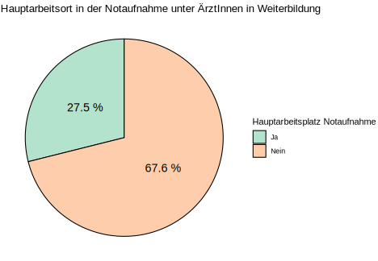

BEAM-Auswertung: ÄrztInnen in Weiterbildung
================

## Frage 1.1 - Welcher Altersgruppe gehören sie an?

| Alter | Anzahl | Prozent |
|:-----:|:------:|:-------:|
| 25-30 |   33   |  32.4   |
| 31-35 |   48   |  47.1   |
| 36-40 |   15   |  14.7   |
| 41-45 |   3    |   2.9   |
| 46-50 |   2    |   2.0   |
| \>50  |   1    |   1.0   |

## Frage 1.5 - In welchem Weiterbildungsjahr befinden Sie sich zum Zeitpunkt der Umfrage?

| Weiterbildungsjahr | Anzahl | Prozent |
|:------------------:|:------:|:-------:|
|         1          |   16   |  16.2   |
|         2          |   14   |  14.1   |
|         3          |   15   |  15.2   |
|         4          |   23   |  23.2   |
|         5          |   21   |  21.2   |
|         6          |   9    |   9.1   |
|         8          |   1    |   1.0   |

## Frage 1.6 - In welchem Fachgebiet streben Sie einen Facharzttitel an?

|                  | Anzahl | Prozent |
|:-----------------|:------:|:-------:|
| Innere Medizin   |   13   |  40.6   |
| Allgemeinmedizin |   7    |  21.9   |
| Anästhesie       |   11   |  34.4   |
| Unfallchirurgie  |   1    |   3.1   |
| Sonstiges        |   2    |   6.2   |

## Frage 1.8 - Planen Sie, die Zusatzbezeichnung “Klinische Akut- und Notfallmedizin” zu erwerben?

| Wollen Zusatzbezeichnung | Anzahl | Prozent |
|:------------------------:|:------:|:-------:|
|            Ja            |   66   |  64.7   |
|           Nein           |   36   |  35.3   |

## Frage 1.10 - In welchem Arbeitsumfeld sind Sie klinisch tätig?

|          Arbeitsumfeld          | Anzahl | Prozent |
|:-------------------------------:|:------:|:-------:|
|       Kleines Krankenhaus       |        |         |
|         (\<200 Betten)          |   8    |   7.8   |
|    Mittelgroßes Krankenhaus     |        |         |
|        (200-500 Betten)         |   44   |  43.1   |
| Schwerpunkt- / Maximalversorger |        |         |
|         (\>500 Betten)          |   45   |  44.1   |
|            Ambulant             |   3    |   2.9   |
|         Ausschließlich          |        |         |
|           Präklinisch           |   0    |   0.0   |
|            Sonstiges            |   0    |   0.0   |

## Frage 1.11 - Sind Sie hauptsächlich in der Notaufnahme tätig?

| Hauptarbeitsplatz Notaufnahme | Anzahl | Prozent |
|:-----------------------------:|:------:|:-------:|
|              Ja               |   28   |  27.5   |
|             Nein              |   69   |  67.6   |

