BEAM-Auswertung: ÄrztInnen in Weiterbildung
================

# 1 - Basisdaten

## Frage 1.1 - Welcher Altersgruppe gehören sie an?

|     Alter     | Anzahl | Prozent |
|:-------------:|:------:|:-------:|
|     25-30     |   33   |  32.4   |
|     31-35     |   48   |  47.1   |
|     36-40     |   15   |  14.7   |
|     41-45     |   3    |   2.9   |
|     46-50     |   2    |   2.0   |
|     \>50      |   1    |   1.0   |
| Antworten (N) |  102   |  100.0  |

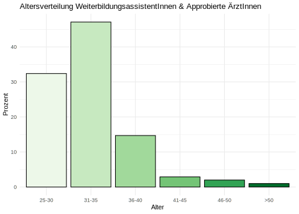

## Frage 1.5 - In welchem Weiterbildungsjahr befinden Sie sich zum Zeitpunkt der Umfrage?

| Weiterbildungsjahr | Anzahl | Prozent |
|:------------------:|:------:|:-------:|
|         1          |   16   |  16.2   |
|         2          |   14   |  14.1   |
|         3          |   15   |  15.2   |
|         4          |   23   |  23.2   |
|         5          |   21   |  21.2   |
|         6          |   9    |   9.1   |
|         8          |   1    |   1.0   |
|   Antworten (N)    |   99   |  100.0  |

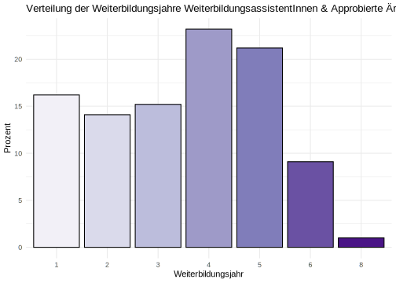

## Frage 1.6 - In welchem Fachgebiet streben Sie einen Facharzttitel an?

|                          | Anzahl | Prozent |
|:-------------------------|:------:|:-------:|
| Innere Medizin           |   13   |  40.6   |
| Allgemeinmedizin         |   7    |  21.9   |
| Anästhesie               |   11   |  34.4   |
| Unfallchirurgie          |   1    |   3.1   |
| Viszeralchirurgie        |   0    |   0.0   |
| Anderes chir. Fachgebiet |   0    |   0.0   |
| Neurologie               |   0    |   0.0   |
| Urologie                 |   0    |   0.0   |
| Sonstiges                |   2    |   6.2   |
| Antworten (N)            |   32   |  100.0  |

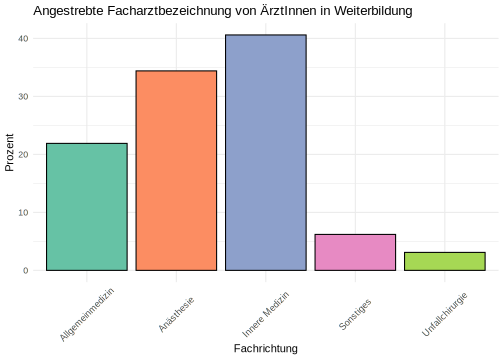

## Frage 1.8 - Planen Sie, die Zusatzbezeichnung “Klinische Akut- und Notfallmedizin” zu erwerben?

| Wollen Zusatzbezeichnung | Anzahl | Prozent |
|:------------------------:|:------:|:-------:|
|            Ja            |   66   |  64.7   |
|           Nein           |   36   |  35.3   |
|      Antworten (N)       |  102   |  100.0  |

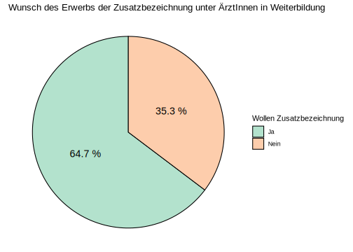

## Frage 1.10 - In welchem Arbeitsumfeld sind Sie klinisch tätig?

|                 Arbeitsumfeld                  | Anzahl | Prozent |
|:----------------------------------------------:|:------:|:-------:|
|       Kleines Krankenhaus (\<200 Betten)       |   8    |   7.8   |
|   Mittelgroßes Krankenhaus (200-500 Betten)    |   44   |  43.1   |
| Schwerpunkt- / Maximalversorger (\>500 Betten) |   45   |  44.1   |
|                    Ambulant                    |   3    |   2.9   |
|           Ausschließlich Präklinisch           |   0    |   0.0   |
|                   Sonstiges                    |   0    |   0.0   |
|                 Antworten (N)                  |  102   |  100.0  |

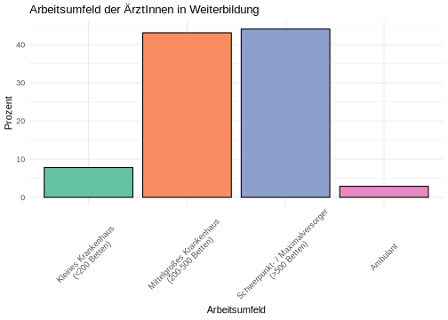

## Frage 1.11 - Sind Sie hauptsächlich in der Notaufnahme tätig?

| Hauptarbeitsplatz Notaufnahme | Anzahl | Prozent |
|:-----------------------------:|:------:|:-------:|
|              Ja               |   28   |  27.5   |
|             Nein              |   69   |  67.6   |
|         Antworten (N)         |  102   |  100.0  |

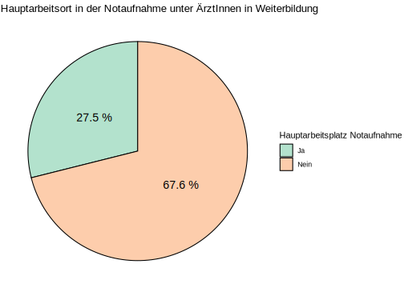

# 2 - Motive zur Fort- & Weiterbildung

## Frage 2.15 - Aus welchen Gründen nehmen Sie regelmäßig an Fort- und Weiterbildungen teil?

| Antwortoption | Anzahl | Prozent |
|:--:|:--:|:--:|
| Ich möchte die Qualität meiner Arbeit verbessern | 94 | 92.2 |
| Ich habe persönliches / berufliches Interesse an den Inhalten | 86 | 84.3 |
| Ich möchte die Versorgungsqualität meiner PatientInnen verbessern | 82 | 80.4 |
| Weil ich fachlich auf dem neuesten Stand bleiben möchte | 77 | 75.5 |
| Ich habe Angst Fehler zu machen | 20 | 19.6 |
| Ich sammle CME Punkte | 8 | 7.8 |
| Mein Arbeitgeber erwartet oder fordert es von mir | 8 | 7.8 |
| Ich möchte Zertifikate / Urkunden erlangen welche ich präsentieren / ausstellen kann | 5 | 4.9 |
| Ich brauche Fortbildungen als Voraussetzung für Zertifizierungen (der Praxis/Abteilung oä.) | 5 | 4.9 |
| Weil mein Umfeld sich regelmäßig fortbildet | 4 | 3.9 |
| Mein Fortbildungsbudget soll nicht verfallen | 1 | 1.0 |
| Ich brauche Fortbildungen als Voraussetzung zur Abrechnung bestimmter Leistungen | 0 | 0.0 |
| Antworten (N) | 102 | 100.0 |

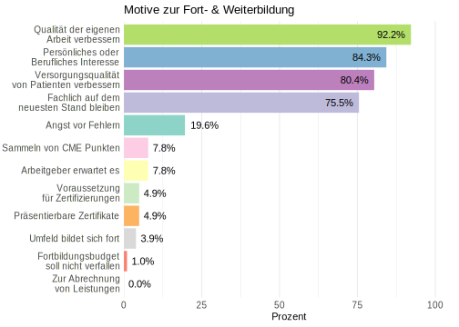

# 3 - Bisherige Nutzung von E-Learning

## Frage 3.16 - Haben Sie in der Vergangenheit bereits E-Learning Angebote zur medizinischen Fort- & Weiterbildung genutzt?

| Bisher E-Learning genutzt | Anzahl | Prozent |
|:-------------------------:|:------:|:-------:|
|            Ja             |   92   |  90.2   |
|           Nein            |   10   |   9.8   |
|       Antworten (N)       |  102   |  100.0  |

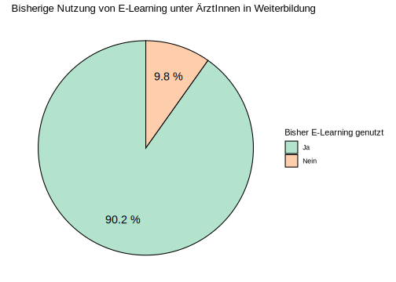

## Frage 3.17 - Welche Art von E-Learning Angeboten haben Sie bereits zur medizinischen Fort- & Weiterbildung genutzt?

| Antwortoption | Anzahl | Prozent |
|:--:|:--:|:--:|
| Online-Nachschlagewerke (Amboss, UpToDate, DocCheck etc.) | 82 | 80.4 |
| Webinare (Live-Veranstaltungen, nur online stattfindend) | 75 | 73.5 |
| Medizinische Informationsplattformen (Ärzteblatt, Medscape, DocCheck etc.) | 71 | 69.6 |
| YouTube | 59 | 57.8 |
| Online-Versionen von Fachzeitschriften | 58 | 56.9 |
| Streaming von Präsenzveranstaltungen (Virtuelle Kongressteilnahme o.Ä.) | 48 | 47.1 |
| On-Demand - ganze Kurse (EKG Kurs, Facharztvorbereitungskurs, Amboss CME-Kurse etc.) | 38 | 37.3 |
| On-Demand - einzelne Vorträge | 36 | 35.3 |
| Online Blogs | 27 | 26.5 |
| Soziale Medien (X/Twitter, Instagram, TikTok etc.) | 24 | 23.5 |
| Sonstige | 0 | 0.0 |
| Antworten (N) | 102 | 100.0 |

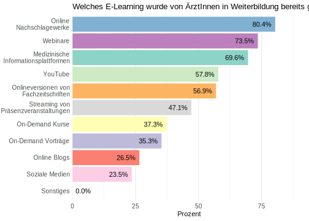

## Frage 3.18 - Mit welchen Endgeräten haben Sie E-Learning Inhalte bisher genutzt?

|    Antwortoption    | Anzahl | Prozent |
|:-------------------:|:------:|:-------:|
| Laptop / Desktop-PC |   82   |  80.4   |
|     Smartphone      |   64   |  62.7   |
|       Tablet        |   36   |  35.3   |
|    Antworten (N)    |  102   |  100.0  |

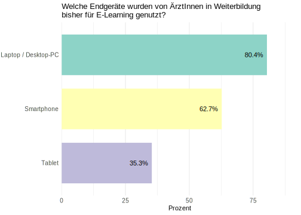

# 4 - Bisherige Finanzierung von E-Learning

## Frage 4.19 - Haben Sie bereits kostenpflichtige E-Learning Inhalte genutzt? (z.B. Amboss, UpToDate, Onlinekurse o.Ä.)

| Bisher kostenpflichtiges E-Learning genutzt | Anzahl | Prozent |
|:-------------------------------------------:|:------:|:-------:|
|                     Ja                      |   91   |  89.2   |
|                    Nein                     |   11   |  10.8   |
|                Antworten (N)                |  102   |  100.0  |

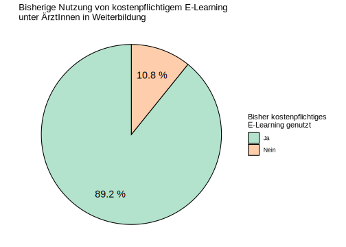

## Frage 4.20 - Welche Art von kostenpflichtigen E-Learning Angeboten haben Sie bereits zur medizinischen Fort & Weiterbildung genutzt?

| Antwortoption | Anzahl | Prozent |
|:--:|:--:|:--:|
| Nachschlagewerke wie UpToDate oder Amboss | 79 | 77.5 |
| Live-Streaming von Präsenzveranstaltungen (Kongresse, Kurse, Vorträge o. Ä.) | 46 | 45.1 |
| Ganze Kursformate On-Demand (z.B. EKG-Kurs, Facharztvorbereitungskurs o. Ä.) | 36 | 35.3 |
| Plattformen zum Abruf von On-Demand-Vorträgen | 18 | 17.6 |
| Kostenpflichtige Podcasts (z.B. Pincast o. Ä.) | 16 | 15.7 |
| Sonstiges | 1 | 1.0 |
| Antworten (N) | 102 | 100.0 |

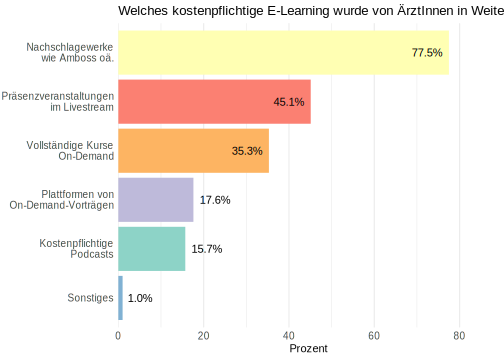

## Frage 4.21 - Durch wen wurden die von Ihnen genutzten E-Learning Angebote finanziert?

|                       Antwortoption                        | Anzahl | Prozent |
|:----------------------------------------------------------:|:------:|:-------:|
|               Vollständig durch mich selbst                |   43   |  42.2   |
|   Teils durch den Arbeitgeber / Teils durch mich selbst    |   37   |  36.3   |
|             Vollständig durch den Arbeitgeber              |   21   |  20.6   |
| Durch Unternehmen (z.B. Pharma, Medizinproduktehersteller) |   4    |   3.9   |
|                         Sonstiges                          |   0    |   0.0   |
|                       Antworten (N)                        |  102   |  100.0  |

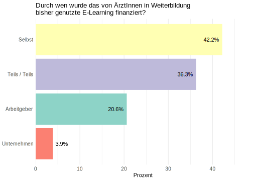
