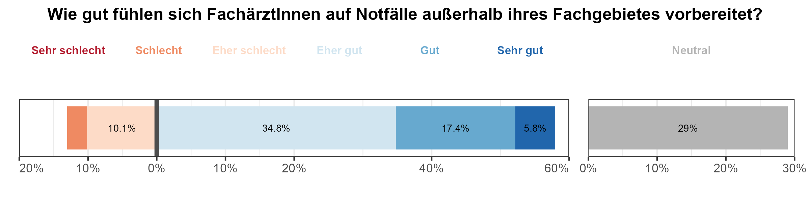

BEAM-Auswertung: FachärztInnen und WeiterbilderInnen
================

------------------------------------------------------------------------

# 6 - Vorbereitung auf notfallmedizinische Krankheitsbilder

## Frage 6.33 - Wie gut fühlen Sie sich auf die Behandlung akut- & notfallmedizinischer Krankheitsbilder in ihrem Fachgebiet vorbereitet?

| Abfrage | Antworten N (%) | Sehr schlecht | Schlecht | Eher schlecht | Neutral | Eher gut | Gut | Sehr gut |
|:--:|:--:|:--:|:--:|:--:|:--:|:--:|:--:|:--:|
| Notfallvorbereitung eigenes Fachgebiet | 69 (100%) | 0 (0%) | 1 (1.4%) | 1 (1.4%) | 7 (10.1%) | 16 (23.2%) | 35 (50.7%) | 9 (13%) |

    ## Warning in mapply(make_inner_box, text, halign, valign, use_markdown, gp_list,
    ## : longer argument not a multiple of length of shorter
    ## Warning in mapply(make_inner_box, text, halign, valign, use_markdown, gp_list,
    ## : longer argument not a multiple of length of shorter

    ## Warning in mapply(make_outer_box, inner_boxes, width, height, x_list, y_list, :
    ## longer argument not a multiple of length of shorter
    ## Warning in mapply(make_outer_box, inner_boxes, width, height, x_list, y_list, :
    ## longer argument not a multiple of length of shorter
    ## Warning in mapply(make_outer_box, inner_boxes, width, height, x_list, y_list, :
    ## longer argument not a multiple of length of shorter

## Frage 6.35 - Wie gut fühlen Sie sich auf die Behandlung akut- & notfallmedizinischer Krankheitsbilder anderer Fachbereiche vorbereitet?

| Abfrage | Antworten N (%) | Sehr schlecht | Schlecht | Eher schlecht | Neutral | Eher gut | Gut | Sehr gut |
|:--:|:--:|:--:|:--:|:--:|:--:|:--:|:--:|:--:|
| Notfallvorbereitung andere Fachgebiete | 69 (100%) | 0 (0%) | 2 (2.9%) | 7 (10.1%) | 20 (29%) | 24 (34.8%) | 12 (17.4%) | 4 (5.8%) |

------------------------------------------------------------------------

# 7 - Fortbildungsbudget und Zahlungsbereitschaft

## Frage 7.43 - Wie hoch ist das Fortbildungsbudget, welches Ihnen ihr Arbeitgeber pro Jahr zur Verfügung stellt?

|     | Fortbildungsbudget | Anzahl | Prozent |
|:----|:------------------:|:------:|:-------:|
| 8   |     Anzahl (N)     |   53   |  100.0  |
| 7   |      \>1000€       |   2    |   3.8   |
| 6   |    801 - 1000€     |   7    |  13.2   |
| 5   |     601 - 800€     |   5    |   9.4   |
| 4   |     401 - 600€     |   9    |  17.0   |
| 3   |     200 - 400€     |   4    |   7.5   |
| 2   |      \< 200€       |   3    |   5.7   |
| 1   |    Kein Budget     |   23   |  43.4   |

## Frage 7.44 - Wie viele als Arbeitszeit gewertete Fortbildungstage gewährt Ihnen ihr Arbeitgeber pro Jahr?

|     | Fortbildungstage | Anzahl | Prozent |
|:----|:----------------:|:------:|:-------:|
| 8   |    Anzahl (N)    |   63   |  100.0  |
| 7   |     \>5 Tage     |   9    |  14.3   |
| 6   |      5 Tage      |   23   |  36.5   |
| 5   |      4 Tage      |   4    |   6.3   |
| 4   |      3 Tage      |   10   |  15.9   |
| 3   |      2 Tage      |   5    |   7.9   |
| 2   |      1 Tag       |   1    |   1.6   |
| 1   |      Keine       |   11   |  17.5   |

## Frage 7.49 - Wie viel würden Sie persönlich, zusätzlich zum Fortbildungsbudget Ihres Arbeitgebers, für einen qualitativ hochwertigen Fortbildungskurs ausgeben?

|     | Zusätzliche Ausgabe | Anzahl | Prozent |
|:----|:-------------------:|:------:|:-------:|
| 8   |     Anzahl (N)      |   69   |  100.0  |
| 7   |       \> 750€       |   25   |  36.2   |
| 6   |     601 - 750€      |   6    |   8.7   |
| 5   |     451 - 600€      |   14   |  20.3   |
| 4   |     301 - 450€      |   7    |  10.1   |
| 3   |     150 - 300€      |   9    |  13.0   |
| 2   |       \< 150€       |   4    |   5.8   |
| 1   |       Keines        |   4    |   5.8   |

## Frage 7.50 - Wie viel Geld würden Sie persönlich, zusätzlich zum Fortbildungsbudget Ihres Arbeitgebers, für einen qualitativ hochwertigen Fortbildungskurs in interdisziplinärer klinischer Notfallmedizin ausgeben?

|     | Zusätzliche Ausgabe | Anzahl | Prozent |
|:----|:-------------------:|:------:|:-------:|
| 8   |     Anzahl (N)      |   69   |  100.0  |
| 7   |       \> 750€       |   17   |  24.6   |
| 6   |     601 - 750€      |   9    |  13.0   |
| 5   |     451 - 600€      |   15   |  21.7   |
| 4   |     301 - 450€      |   6    |   8.7   |
| 3   |     150 - 300€      |   12   |  17.4   |
| 2   |       \< 150€       |   4    |   5.8   |
| 1   |       Keines        |   6    |   8.7   |

------------------------------------------------------------------------

# Weiterbildende - Fortbildungsbudget der MedizinerInnen in Weiterbildung

## Frage 7.45 - Wie hoch ist das Fortbildungsbudget, welches Ihr Arbeitgeber Ihren ÄrztInnen in Weiterbildung pro Jahr zur Verfügung stellt?

|     | Fortbildungsbudget | Anzahl | Prozent |
|:----|:------------------:|:------:|:-------:|
| 11  |     Anzahl (N)     |  126   |  100.0  |
| 7   |      \>1000€       |   19   |  15.1   |
| 5   |     601 - 800€     |   13   |  10.3   |
| 4   |     401 - 600€     |   29   |  23.0   |
| 3   |     200 - 400€     |   29   |  23.0   |
| 2   |      \< 200€       |   9    |   7.1   |
| 1   |    Kein Budget     |   27   |  21.4   |

## Frage 7.46 - Wie viele als Arbeitszeit gewertete Fortbildungstage gewährt Ihr Arbeitgeber Ihren ÄrztInnen in Weiterbildung pro Jahr?

|     | Fortbildungstage | Anzahl | Prozent |
|:----|:----------------:|:------:|:-------:|
| 11  |    Anzahl (N)    |  174   |  100.0  |
| 7   |     \>5 Tage     |   19   |  10.9   |
| 6   |      5 Tage      |   94   |  54.0   |
| 5   |      4 Tage      |   5    |   2.9   |
| 4   |      3 Tage      |   46   |  26.4   |
| 3   |      2 Tage      |   9    |   5.2   |
| 1   |      Keine       |   1    |   0.6   |

