BEAM-Auswertung: MedizinerInnen in Weiterbildung
================

------------------------------------------------------------------------

# 1 - Basisdaten

## Frage 1.1 - Welcher Altersgruppe gehören sie an?

|     Alter     | Anzahl | Prozent |
|:-------------:|:------:|:-------:|
|     25-30     |   15   |  50.0   |
|     31-35     |   11   |  36.7   |
|     36-40     |   2    |   6.7   |
|     46-50     |   1    |   3.3   |
|     \>50      |   1    |   3.3   |
| Antworten (N) |   30   |  100.0  |

## Frage 1.5 - In welchem Weiterbildungsjahr befinden Sie sich zum Zeitpunkt der Umfrage?

| Weiterbildungsjahr | Anzahl | Prozent |
|:------------------:|:------:|:-------:|
|         1          |   16   |  53.3   |
|         2          |   14   |  46.7   |
|   Antworten (N)    |   30   |  100.0  |

## Frage 1.6 - In welchem Fachgebiet streben Sie einen Facharzttitel an?

| Anzahl | Prozent |
|:------:|:-------:|
|   6    |  46.2   |
|   4    |  30.8   |
|   3    |  23.1   |
|   0    |   0.0   |
|   0    |   0.0   |
|   0    |   0.0   |
|   0    |   0.0   |
|   0    |   0.0   |
|   1    |   7.7   |
|   13   |  100.0  |

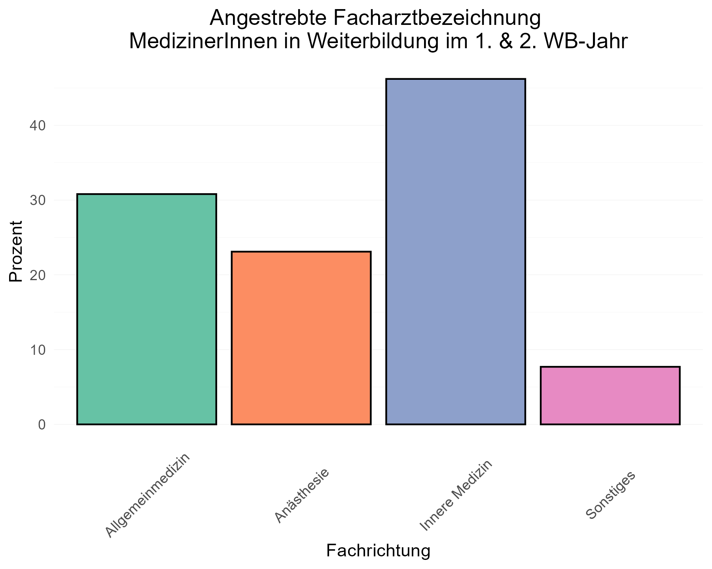

## Frage 1.8 - Planen Sie, die Zusatzbezeichnung “Klinische Akut- und Notfallmedizin” zu erwerben?

| Wollen Zusatzbezeichnung | Anzahl | Prozent |
|:------------------------:|:------:|:-------:|
|            Ja            |   22   |  73.3   |
|           Nein           |   8    |  26.7   |
|      Antworten (N)       |   30   |  100.0  |

## Frage 1.10 - In welchem Arbeitsumfeld sind Sie klinisch tätig?

|                 Arbeitsumfeld                  | Anzahl | Prozent |
|:----------------------------------------------:|:------:|:-------:|
|       Kleines Krankenhaus (\<200 Betten)       |   2    |   6.7   |
|   Mittelgroßes Krankenhaus (200-500 Betten)    |   12   |  40.0   |
| Schwerpunkt- / Maximalversorger (\>500 Betten) |   13   |  43.3   |
|                    Ambulant                    |   3    |  10.0   |
|           Ausschließlich Präklinisch           |   0    |   0.0   |
|                   Sonstiges                    |   0    |   0.0   |
|                 Antworten (N)                  |   30   |  100.0  |

## Frage 1.11 - Sind Sie hauptsächlich in der Notaufnahme tätig?

| Hauptsächlich Notaufnahme | Anzahl | Prozent |
|:-------------------------:|:------:|:-------:|
|            Ja             |   5    |  18.5   |
|           Nein            |   22   |  81.5   |
|       Antworten (N)       |   27   |  100.0  |

## Frage 1.12 - Ist Deutsch Ihre Muttersprache?

| Muttersprache | Anzahl | Prozent |
|:-------------:|:------:|:-------:|
|    Deutsch    |   28   |  93.3   |
|    Andere     |   2    |   6.7   |
| Antworten (N) |   30   |  100.0  |

------------------------------------------------------------------------

# 2 - Motive zur Fort- & Weiterbildung

## Frage 2.15 - Aus welchen Gründen nehmen Sie regelmäßig an Fort- und Weiterbildungen teil?

| Antwortoption | Anzahl | Prozent |
|:--:|:--:|:--:|
| Ich habe persönliches / berufliches Interesse an den Inhalten | 27 | 90.0 |
| Ich möchte die Qualität meiner Arbeit verbessern | 27 | 90.0 |
| Ich möchte die Versorgungsqualität meiner PatientInnen verbessern | 24 | 80.0 |
| Weil ich fachlich auf dem neuesten Stand bleiben möchte | 19 | 63.3 |
| Ich habe Angst Fehler zu machen | 8 | 26.7 |
| Mein Arbeitgeber erwartet oder fordert es von mir | 5 | 16.7 |
| Ich sammle CME Punkte | 2 | 6.7 |
| Ich möchte Zertifikate / Urkunden erlangen welche ich präsentieren / ausstellen kann | 2 | 6.7 |
| Weil mein Umfeld sich regelmäßig fortbildet | 2 | 6.7 |
| Ich brauche Fortbildungen als Voraussetzung für Zertifizierungen (der Praxis/Abteilung oä.) | 2 | 6.7 |
| Ich brauche Fortbildungen als Voraussetzung zur Abrechnung bestimmter Leistungen | 0 | 0.0 |
| Mein Fortbildungsbudget soll nicht verfallen | 0 | 0.0 |
| Antworten (N) | 30 | 100.0 |

------------------------------------------------------------------------

# 3 - Bisherige Nutzung von E-Learning

## Frage 3.16 - Haben Sie in der Vergangenheit bereits E-Learning Angebote zur medizinischen Fort- & Weiterbildung genutzt?

| Bereits E-Learning genutzt | Anzahl | Prozent |
|:--------------------------:|:------:|:-------:|
|             Ja             |   24   |   80    |
|            Nein            |   6    |   20    |
|       Antworten (N)        |   30   |   100   |

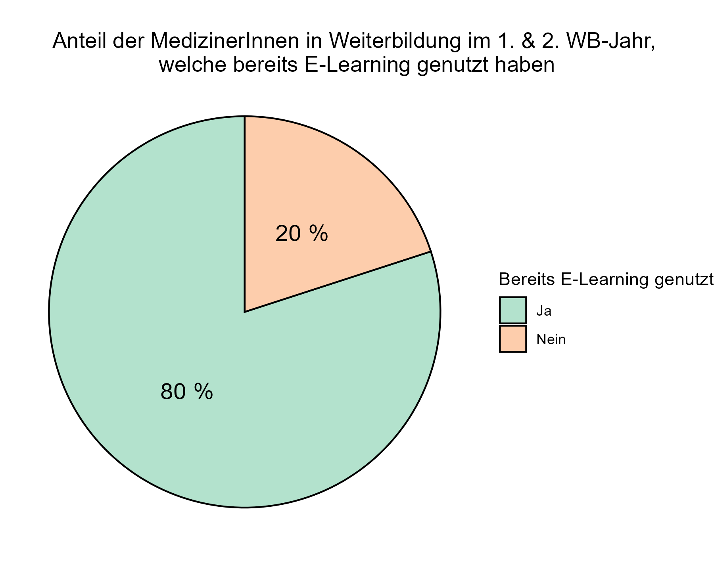

## Frage 3.17 - Welche Art von E-Learning Angeboten haben Sie bereits zur medizinischen Fort- & Weiterbildung genutzt?

| Antwortoption | Anzahl | Prozent |
|:--:|:--:|:--:|
| Online-Nachschlagewerke (Amboss, UpToDate, DocCheck etc.) | 21 | 70.0 |
| Medizinische Informationsplattformen (Ärzteblatt, Medscape, DocCheck etc.) | 20 | 66.7 |
| Webinare (Live-Veranstaltungen, nur online stattfindend) | 19 | 63.3 |
| YouTube | 15 | 50.0 |
| Online-Versionen von Fachzeitschriften | 14 | 46.7 |
| Streaming von Präsenzveranstaltungen (Virtuelle Kongressteilnahme o.Ä.) | 12 | 40.0 |
| On-Demand - ganze Kurse (EKG Kurs, Facharztvorbereitungskurs, Amboss CME-Kurse etc.) | 10 | 33.3 |
| Online Blogs | 9 | 30.0 |
| Soziale Medien (X/Twitter, Instagram, TikTok etc.) | 9 | 30.0 |
| On-Demand - einzelne Vorträge | 7 | 23.3 |
| Sonstige | 0 | 0.0 |
| Antworten (N) | 30 | 100.0 |

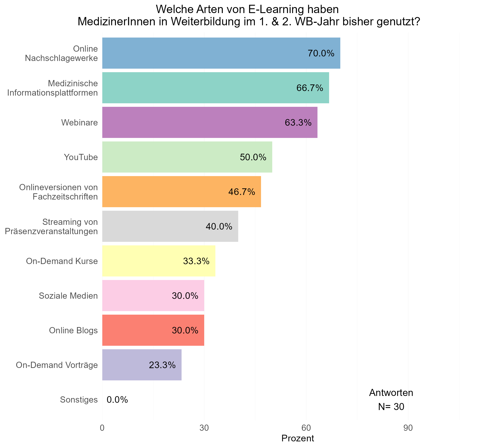

## Frage 3.18 - Mit welchen Endgeräten haben Sie E-Learning Inhalte bisher genutzt?

|    Antwortoption    | Anzahl | Prozent |
|:-------------------:|:------:|:-------:|
| Laptop / Desktop-PC |   23   |  76.7   |
|     Smartphone      |   15   |  50.0   |
|       Tablet        |   11   |  36.7   |
|    Antworten (N)    |   30   |  100.0  |

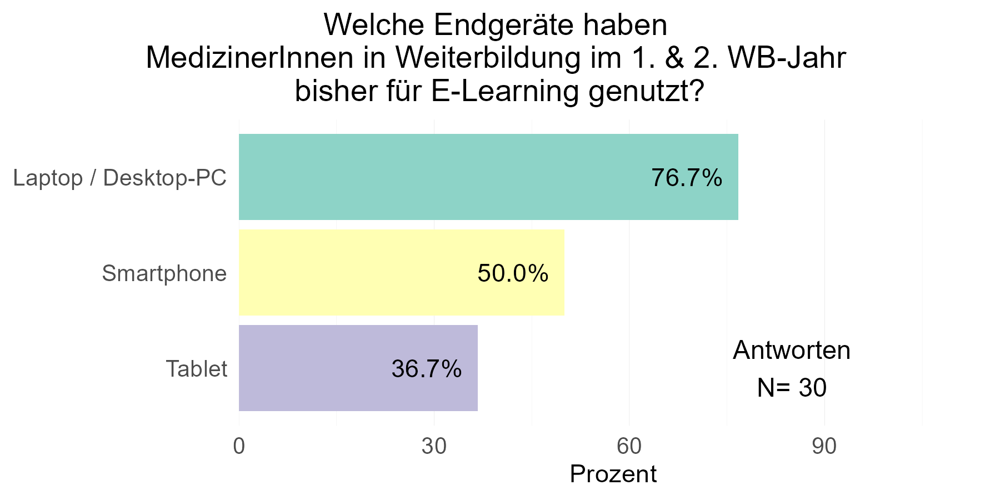

------------------------------------------------------------------------

# 4 - Bisherige Finanzierung von E-Learning

## Frage 4.19 - Haben Sie bereits kostenpflichtige E-Learning Inhalte genutzt? (z.B. Amboss, UpToDate, Onlinekurse o.Ä.)

| Bereits kostenpflichtiges E-Learning genutzt | Anzahl | Prozent |
|:--------------------------------------------:|:------:|:-------:|
|                      Ja                      |   24   |   80    |
|                     Nein                     |   6    |   20    |
|                Antworten (N)                 |   30   |   100   |

\## Frage 4.20 - Welche Art von kostenpflichtigen E-Learning Angeboten
haben Sie bereits zur medizinischen Fort & Weiterbildung genutzt?

| Antwortoption | Anzahl | Prozent |
|:--:|:--:|:--:|
| Nachschlagewerke wie UpToDate oder Amboss | 23 | 76.7 |
| Ganze Kursformate On-Demand (z.B. EKG-Kurs, Facharztvorbereitungskurs o. Ä.) | 11 | 36.7 |
| Live-Streaming von Präsenzveranstaltungen (Kongresse, Kurse, Vorträge o. Ä.) | 9 | 30.0 |
| Plattformen zum Abruf von On-Demand-Vorträgen | 4 | 13.3 |
| Kostenpflichtige Podcasts (z.B. Pincast o. Ä.) | 2 | 6.7 |
| Sonstiges | 0 | 0.0 |
| Antworten (N) | 30 | 100.0 |

## Frage 4.21 - Durch wen wurden die von Ihnen genutzten E-Learning Angebote finanziert?

|                       Antwortoption                        | Anzahl | Prozent |
|:----------------------------------------------------------:|:------:|:-------:|
|               Vollständig durch mich selbst                |   10   |  33.3   |
|   Teils durch den Arbeitgeber / Teils durch mich selbst    |   10   |  33.3   |
|             Vollständig durch den Arbeitgeber              |   5    |  16.7   |
| Durch Unternehmen (z.B. Pharma, Medizinproduktehersteller) |   1    |   3.3   |
|                         Sonstiges                          |   0    |   0.0   |
|                       Antworten (N)                        |   30   |  100.0  |

------------------------------------------------------------------------

# 5 - Ideales E-Learning

## Frage 5.22 - Können Sie sich vorstellen, in Zukunft E-Learning Inhalte zur Fort- & Weiterbildung zu nutzen?

| Zukünftige Nutzung E-Learning | Anzahl | Prozent |
|:-----------------------------:|:------:|:-------:|
|              Ja               |   29   |  96.7   |
|             Nein              |   1    |   3.3   |
|         Antworten (N)         |   30   |  100.0  |

## Frage 5.23 - Würden Sie E-Learning für folgende Anwendungsfälle nutzen?

| Abfrage | Antworten N (%) | Auf keinen Fall | Wahrscheinlich nicht | Eher nicht | Neutral | Eher ja | Wahrscheinlich ja | Auf jeden Fall |
|:--:|:--:|:--:|:--:|:--:|:--:|:--:|:--:|:--:|
| Erlernen fachlicher |  |  |  |  |  |  |  |  |
| Grundlagen | 29 (100%) | 0 (0%) | 0 (0%) | 1 (3.4%) | 0 (0%) | 3 (10.3%) | 5 (17.2%) | 20 (69%) |
| Alternative zu Präsenzveranstaltungen | 29 (100%) | 0 (0%) | 1 (3.4%) | 6 (20.7%) | 4 (13.8%) | 6 (20.7%) | 4 (13.8%) | 8 (27.6%) |
| Weiterbildung in spez. Fachbereichen | 29 (100%) | 0 (0%) | 0 (0%) | 0 (0%) | 2 (6.9%) | 3 (10.3%) | 9 (31%) | 15 (51.7%) |
| Wissen aktuell halten | 29 (100%) | 0 (0%) | 0 (0%) | 0 (0%) | 1 (3.4%) | 1 (3.4%) | 6 (20.7%) | 21 (72.4%) |
| CME-Punkte sammeln | 29 (100%) | 1 (3.4%) | 1 (3.4%) | 0 (0%) | 1 (3.4%) | 4 (13.8%) | 2 (6.9%) | 20 (69%) |

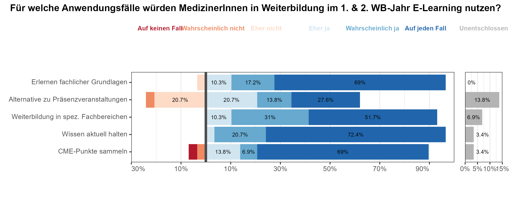

## Frage 5.24 - Wie wichtig ist es Ihnen, CME-Punkte für die E-Learning Inhalte zu erhalten?

| Abfrage | Antworten N (%) | Unwichtig | Eher unwichtig | Weniger wichtig | Neutral | Eher wichtig | Wichtig | Sehr wichtig |
|:--:|:--:|:--:|:--:|:--:|:--:|:--:|:--:|:--:|
| CME-Punkte erhalten | 26 (100%) | 0 (0%) | 1 (3.8%) | 1 (3.8%) | 9 (34.6%) | 7 (26.9%) | 6 (23.1%) | 2 (7.7%) |

    ## Warning in mapply(make_inner_box, text, halign, valign, use_markdown, gp_list,
    ## : longer argument not a multiple of length of shorter
    ## Warning in mapply(make_inner_box, text, halign, valign, use_markdown, gp_list,
    ## : longer argument not a multiple of length of shorter

    ## Warning in mapply(make_outer_box, inner_boxes, width, height, x_list, y_list, :
    ## longer argument not a multiple of length of shorter
    ## Warning in mapply(make_outer_box, inner_boxes, width, height, x_list, y_list, :
    ## longer argument not a multiple of length of shorter
    ## Warning in mapply(make_outer_box, inner_boxes, width, height, x_list, y_list, :
    ## longer argument not a multiple of length of shorter

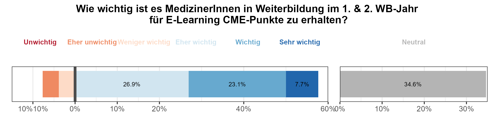

------------------------------------------------------------------------

# 6 - Vorbereitung auf notfallmedizinische Krankheitsbilder

## Frage 6.33 - Wie gut fühlen Sie sich auf die Behandlung akut- & notfallmedizinischer Krankheitsbilder in ihrem Fachgebiet vorbereitet?

| Abfrage | Antworten N (%) | Sehr schlecht | Schlecht | Eher schlecht | Neutral | Eher gut | Gut | Sehr gut |
|:--:|:--:|:--:|:--:|:--:|:--:|:--:|:--:|:--:|
| Notfallvorbereitung eigenes Fachgebiet | 30 (100%) | 0 (0%) | 2 (6.7%) | 7 (23.3%) | 5 (16.7%) | 11 (36.7%) | 5 (16.7%) | 0 (0%) |

## Frage 6.35 - Wie gut fühlen Sie sich auf die Behandlung akut- & notfallmedizinischer Krankheitsbilder anderer Fachbereiche vorbereitet?

| Abfrage | Antworten N (%) | Sehr schlecht | Schlecht | Eher schlecht | Neutral | Eher gut | Gut | Sehr gut |
|:--:|:--:|:--:|:--:|:--:|:--:|:--:|:--:|:--:|
| Notfallvorbereitung andere Fachgebiete | 30 (100%) | 2 (6.7%) | 5 (16.7%) | 13 (43.3%) | 4 (13.3%) | 5 (16.7%) | 1 (3.3%) | 0 (0%) |

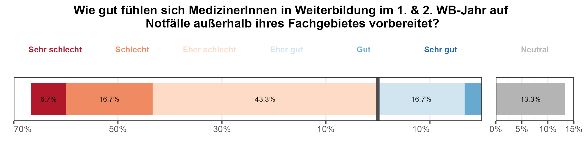

## Frage 6.39 - Wie sehr belasten Sie **Nachtdienste** in Ihrem aktuellen Ausbildungsstand aus **emotionaler** Sicht?

| Abfrage | Überhaupt nicht | Kaum | Ein bisschen | Belastet | Sehr |
|:--:|:--:|:--:|:--:|:--:|:--:|
| Emotionale Belastung Nachtdienst | 2 | 3 | 9 | 12 | 4 |

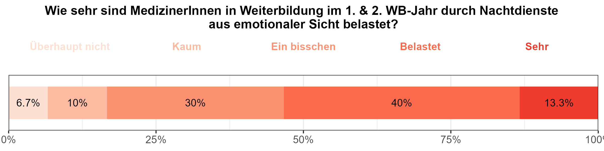

## Frage 6.40 - Wie sehr belasten Sie Nachtdienste in Ihrem aktuellen Ausbildungsstand aus fachlicher Sicht?

| Abfrage | Überhaupt nicht | Kaum | Ein bisschen | Belastet | Sehr |
|:--:|:--:|:--:|:--:|:--:|:--:|
| Fachliche Belastung Nachtdienst | 1 | 7 | 9 | 10 | 3 |

## Frage 6.41 - Wie sehr belasten Sie Notaufnahmedienste in Ihrem aktuellen Ausbildungsstand aus emotionaler Sicht?

| Abfrage | Überhaupt nicht | Kaum | Ein bisschen | Belastet | Sehr |
|:--:|:--:|:--:|:--:|:--:|:--:|
| Emotionale Belastung Notaufnahmedienst | 3 | 9 | 4 | 11 | 3 |

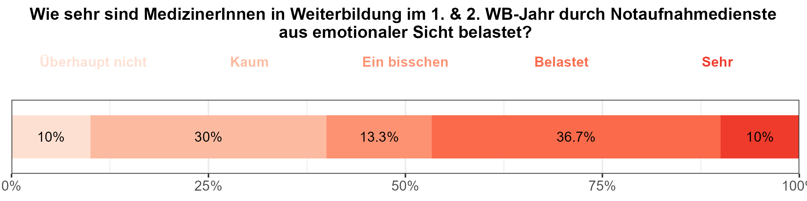

## Frage 6.42 - Wie sehr belasten Sie Notaufnahmedienste in Ihrem aktuellen Ausbildungsstand aus fachlicher Sicht?

| Abfrage | Überhaupt nicht | Kaum | Ein bisschen | Belastet | Sehr |
|:--:|:--:|:--:|:--:|:--:|:--:|
| Fachliche Belastung Notaufnahmedienst | 0 | 5 | 12 | 10 | 3 |

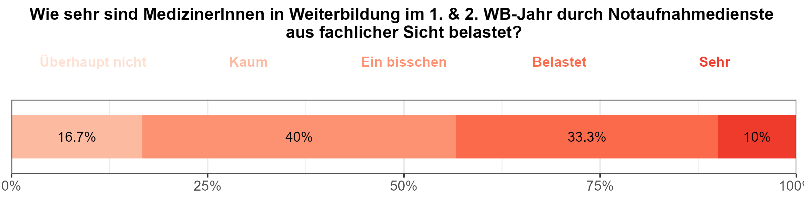

------------------------------------------------------------------------

# 7 - Fortbildungsbudget und Zahlungsbereitschaft

## Frage 7.43 - Wie hoch ist das Fortbildungsbudget, welches Ihnen ihr Arbeitgeber pro Jahr zur Verfügung stellt?

| Fortbildungsbudget | Anzahl | Prozent |
|:------------------:|:------:|:-------:|
|     Anzahl (N)     |   18   |  100.0  |
|      \>1000€       |   3    |  16.7   |
|    801 - 1000€     |   1    |   5.6   |
|     601 - 800€     |   1    |   5.6   |
|     401 - 600€     |   5    |  27.8   |
|     200 - 400€     |   4    |  22.2   |
|      \< 200€       |   1    |   5.6   |
|    Kein Budget     |   3    |  16.7   |

## Frage 7.44 - Wie viele als Arbeitszeit gewertete Fortbildungstage gewährt Ihnen ihr Arbeitgeber pro Jahr?

| Fortbildungstage | Anzahl | Prozent |
|:----------------:|:------:|:-------:|
|    Anzahl (N)    |   25   |   100   |
|     \>5 Tage     |   8    |   32    |
|      5 Tage      |   10   |   40    |
|      4 Tage      |   3    |   12    |
|      3 Tage      |   4    |   16    |

## Frage 7.49 - Wie viel würden Sie persönlich, zusätzlich zum Fortbildungsbudget Ihres Arbeitgebers, für einen qualitativ hochwertigen Fortbildungskurs ausgeben?

| Zusätzliche Ausgabe | Anzahl | Prozent |
|:-------------------:|:------:|:-------:|
|     Anzahl (N)      |   30   |  100.0  |
|       \> 750€       |   6    |  20.0   |
|     601 - 750€      |   2    |   6.7   |
|     451 - 600€      |   7    |  23.3   |
|     301 - 450€      |   1    |   3.3   |
|     150 - 300€      |   11   |  36.7   |
|       \< 150€       |   1    |   3.3   |
|       Keines        |   2    |   6.7   |

## Frage 7.50 - Wie viel Geld würden Sie persönlich, zusätzlich zum Fortbildungsbudget Ihres Arbeitgebers, für einen qualitativ hochwertigen Fortbildungskurs in interdisziplinärer klinischer Notfallmedizin ausgeben?

| Zusätzliche Ausgabe | Anzahl | Prozent |
|:-------------------:|:------:|:-------:|
|     Anzahl (N)      |   30   |  100.0  |
|       \> 750€       |   3    |  10.0   |
|     601 - 750€      |   3    |  10.0   |
|     451 - 600€      |   3    |  10.0   |
|     301 - 450€      |   5    |  16.7   |
|     150 - 300€      |   11   |  36.7   |
|       \< 150€       |   2    |   6.7   |
|       Keines        |   3    |  10.0   |

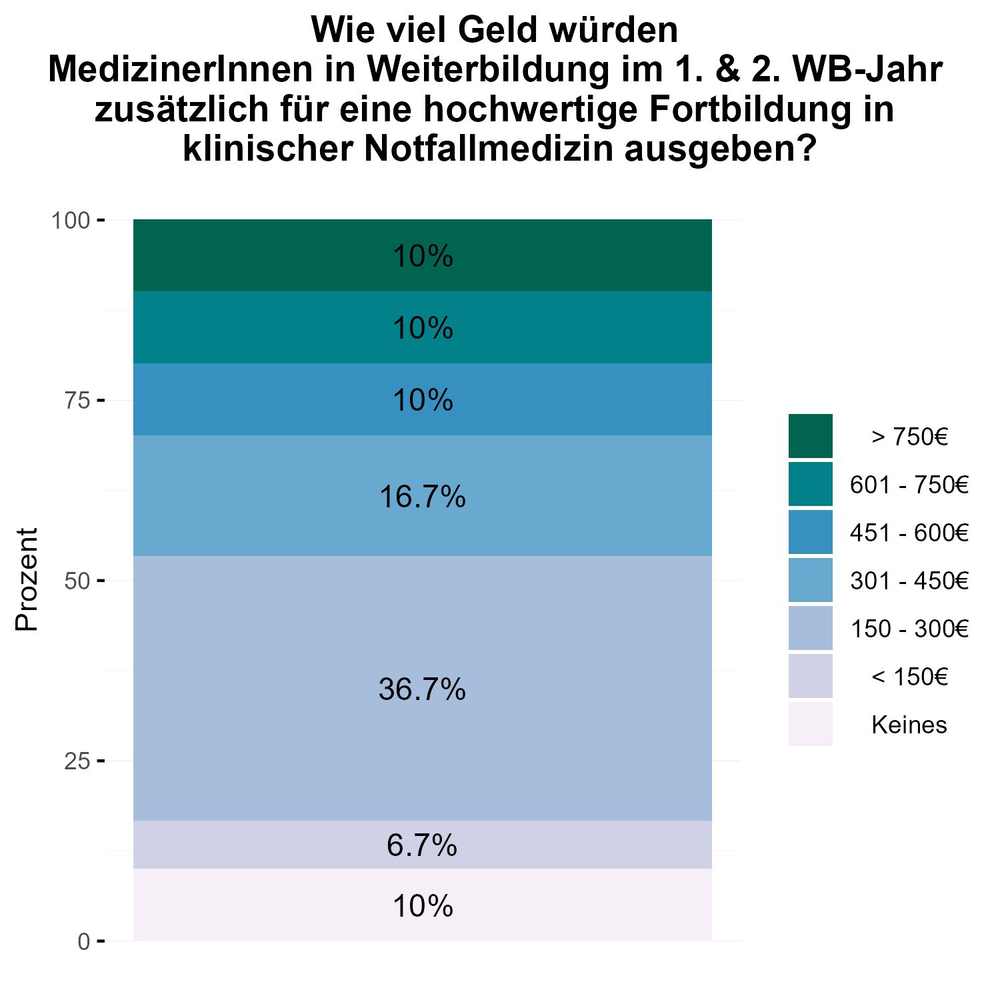
